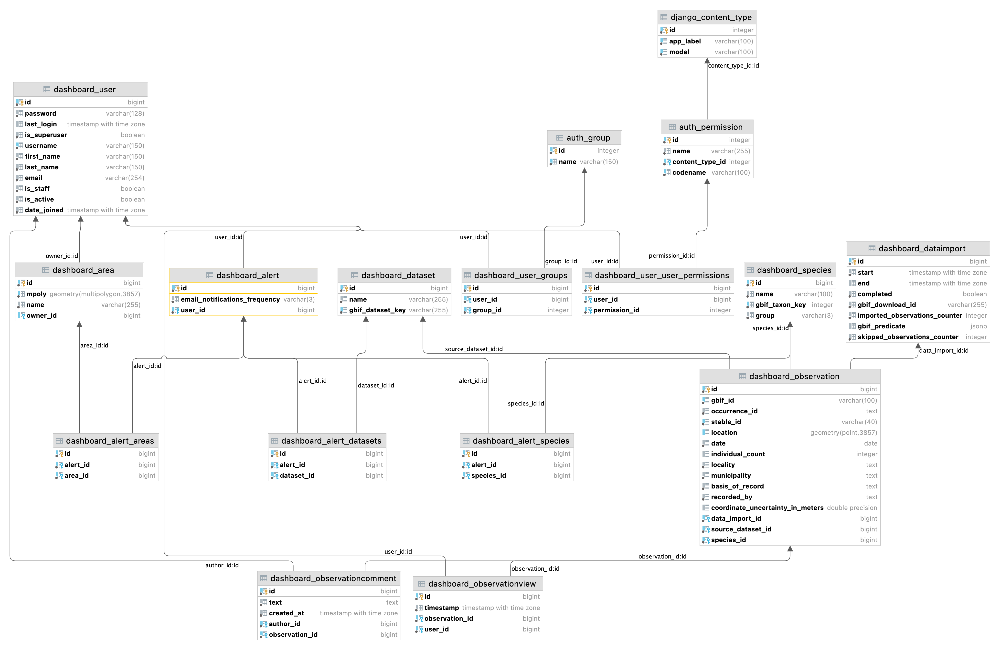

# Development setup and notes

## Technological backbone
- [Python](https://www.python.org/) 3.8+, [(Geo)Django](https://www.djangoproject.com/) 3.2 LTS, [PostgreSQL](https://www.postgresql.org/), [PostGIS](https://postgis.net/) 3.1+, [TypeScript](https://www.typescriptlang.org/) and [Vue.js v3](https://vuejs.org/)
- CSS: [Bootstrap](https://getbootstrap.com/) 5.1  
- [Poetry](https://python-poetry.org/) is used to manage dependencies (use `poetry add`, `poetry install`, ... instead of pip). PyCharm also has a Poetry plugin available.

## Dev environment configuration
- Python>=3.8, PostGIS>=3.1 and `npm` are required
- Use [Poetry](https://python-poetry.org/) to create an isolated virtualenv and install dependencies (`poetry install`) 
- Copy `local_settings.template.py` to `local_settings.py`, adjust those settings and point Django to `local_settings.py`
- [Point Django to local_settings](https://docs.djangoproject.com/en/3.2/topics/settings/#designating-the-settings)

## Testing / typing
This project provides the following tools to ensure the application and code stays in a decent state:

- Standard Django tests (can be run with `$ ./manage.py test`), including Selenium-based testing for frontend features and high-level tests
- Typing: can be checked with `$ mypy .`

Those should be run frequently on the developer's machines, but will also be executed by GitHub actions each time the code is pushed to GitHub (see the CI-CD section)

## CI-CD

We make use of GitHub Actions when possible. They're currently used to:

- Run Django tests and `mypy` on push
- Deploy to dev server on push

## Dependencies

We try to frequently update dependencies. Process is:

- Backend: `$ poetry update`
- Frontend: `$ npm-check -u`
- Run unit tests (+ a few manual checks?)
- Commit changes (should include `package.json`, `package-lock.json` and `poetry lock` 

## Database diagram

Only the tables from the `dashboard` app (+linked tables) are included. Last update: 20 jan 2022.


## Frontend-backend integration

We use a hybrid approach such as described in https://www.saaspegasus.com/guides/modern-javascript-for-django-developers/integrating-javascript-pipeline/:

- npm is used to manage JS dependencies (**npm install** should be run once)
- **During development**, run `npm run webpack-dev` so Webpack constantly watches our source frontend (in `./assets`) and create bundles (in `./static`)
- **When deploying**, use `npm run webpack prod` instead (smaller bundle size + one single copy - rather than watching files)

## Code formatting

We use `black` (for Python code) and `prettier` (for JS/TS/Vue) to automatically and consistently format the source code.
Please configure your favorite editor/IDE to format on save. 

## Observation import mechanism

The observation data shown in the webapp can be automatically updated by running the `import_observations` management 
command. This one will trigger a GBIF Download for our search of interest (target country + species in the database) and 
load the corresponding observations into the database. At the end of the process, observations from previous data 
imports are deleted to avoid duplicates.

The data import history is recorded with the DataImport model, and shown to the user on the "about" page.

=> For a given observation, Django-managed IDs are therefore not stable. A hashing mechanism (based on `occurrenceId` 
and `DatasetKey`) to allow recognizing a given observation is implemented (`stable_id` field on Observation).

## Areas import mechanism

The application allows storing Areas (multipolygons) in the database for observation filtering and to display as map 
overlays. Each area can be either user-specific, either public. For now, there are 
two ways to load a new area in the system:

- An administrator can use the Admin section to hand-drawn the area over an OSM background
- The custom `load_area` management command can be used to directly import complex polygons from a file 
  source (shapefile, GeoJSON, ...)
  
### How to use the `load_area` command to import a new public Area

1) Copy the source data file to `source_data/public_areas`
2) Adjust the `LAYER_MAPPING_CONFIGURATION` constant in `load_area.py` so it can deal with the specificities 
   of the new source file (other adjustments to `load_area.py` may also be necessary, see 
   [LayerMapping documentation](https://docs.djangoproject.com/en/3.2/ref/contrib/gis/layermapping/).)
3) Run `$ python manage.py load_area <my_source_file>`


## Users

The web application handle three categories of users:

- Anonymous users can access the website and visualize the observation data via the dashboard. For Django, they are 
  unauthenticated.
- Registered "normal" users can do all what can anonymous users can do + create and configure their alerts. Those users can 
  sign up directly thanks to a specific form (an e-mail address is required because it is needed for e-mail 
  notifications). For Django, they are regular users without any specific group or permission (**not** 
  staff, **not** superuser)
- Admins can do all that registered users can do + access the admin interface to configure the web application. For 
  Django they have the **staff** and **superuser** flags set. Admins can be created by different means, for example 
  being upgraded to this status by an existing Admin after registering as a normal user, or via Django's 
  `createsuperuser` management command.
  
## Use of the messages framework

We make use of [Django's message framework](https://docs.djangoproject.com/en/3.2/ref/contrib/messages/), and the 
base template is configured to display a nice Bootstrap alert for the following message levels: `info`, `success`, 
`warning` and `error`.

Example use:
```
from django.contrib import messages

def my_view(request):
  ...
  messages.success(request, "Your profile was successfully updated.")
  return redirect("dashboard:pages:index")
```

## Maintenance mode

We make use of [django-maintenance-mode](https://github.com/fabiocaccamo/django-maintenance-mode). 

Maintenance mode will be set during each (observation) data import (data would be inconsistent at this stage, so we don't
want to let users access the website, nor send e-mail notifications).

This tool can also be used to manually activate maintenance mode during complex maintenance tasks, look at 
[django-maintenance-mode documentation](https://github.com/fabiocaccamo/django-maintenance-mode).
