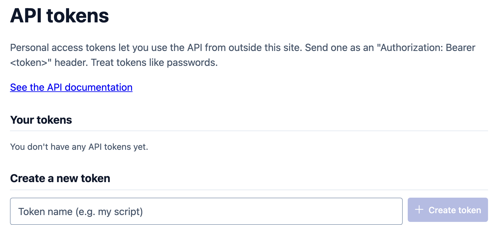

# Going further

Ways to use a GBIF Alert site's data outside the site itself: links that open a
ready-filtered view, the observations in your GIS, the original data on GBIF,
and the API for scripts and applications.

## Link to a filtered view

The simplest way to point someone to a selection of observations is to set the
filters on the home page and copy the address from your browser (see
[Filtering](explore.md#filtering)).

You can also write such links yourself, for example to link from a website or a
newsletter. On the demo site, this link opens the observations of two crayfish
species in Flanders:

    https://demo.gbif-alert.org/?speciesIds=3-4&areaIds=2

Species, areas and datasets are referred to by number. The easiest way to find
them is to select them in the filters and look at the address. Two things to
keep in mind:

- If the site starts with an area already selected, a link without `areaIds`
  applies it. Add `areaIds=none` to show everything.
- Signed-in visitors see only the observations they have not viewed yet, unless
  the link says `status=all`.

The full list of parameters is in the
[developer notes](https://github.com/riparias/gbif-alert/blob/devel/CONTRIBUTING.md#how-to-link-to-a-gbif-alert-instance-with-specific-filters).

## Open the observations in QGIS

Every GBIF Alert site publishes its observations as a **WFS** (Web Feature
Service), a standard way for GIS software to read map data from a website. No
account is needed.

In QGIS:

1. Open **Layer > Add Layer > Add WFS / OGC API - Features Layer**.
2. Click **New** to add a connection. Give it a name, and as **URL** the site's
   address followed by `/api/wfs/observations`. For the demo site:
   `https://demo.gbif-alert.org/api/wfs/observations`
3. Click **OK**, then **Connect**, select the **observation** layer, and click
   **Add**.

The layer holds every observation on the site, not only the ones matching your
filters on the website: filter it in QGIS instead. For a large site, tick **Only
request features overlapping the view extent** before adding the layer, so QGIS
only downloads what you are looking at.

Each observation comes with its species (scientific name, vernacular names, and
GBIF and Catalogue of Life keys), dataset, date, municipality, locality, basis of
record, recorder, individual count, coordinate uncertainty and verification
status. `gbif_id` is the record's number on GBIF, and `stable_id` opens it on the
site at `/observation/<stable_id>`.

The layer is live: reload it in QGIS to get the observations from the latest
data import.

## Get the original data from GBIF

The site builds its data from GBIF downloads, and **About the data** links to the
GBIF download behind the latest data import. From there you can download the
complete records, with every field GBIF provides, and get the citation to use if
you publish work based on them.

## Use the API

The API lets scripts and applications read the site's data, in R, Python or any
other language. Each site documents its own API: follow **API** at the bottom of
any page, or go to `/api-docs`, for an overview, rate limits and a link to the
full interactive reference (`/api/v2/docs`). See, for example, the
[demo site's API page](https://demo.gbif-alert.org/api-docs).

Public data, such as observations, species and areas, can be read without an
account. Anything tied to your account, such as your alerts, and every change,
such as creating an area, needs an **API token**:

{ width="560" }

1. Open **API tokens** from your menu.
2. Give the token a name that says where you will use it, such as `my R script`,
   and click **Create token**.
3. Copy the token straight away: the site shows it only once. The page also
   shows a ready-to-run command that fetches your alerts with it.
4. Send the token with each request, as an `Authorization: Bearer <token>`
   header.

Treat a token like a password. **Revoke** it on the same page when you no
longer need it, or if you think someone else has seen it: anything using it
stops working at once.
