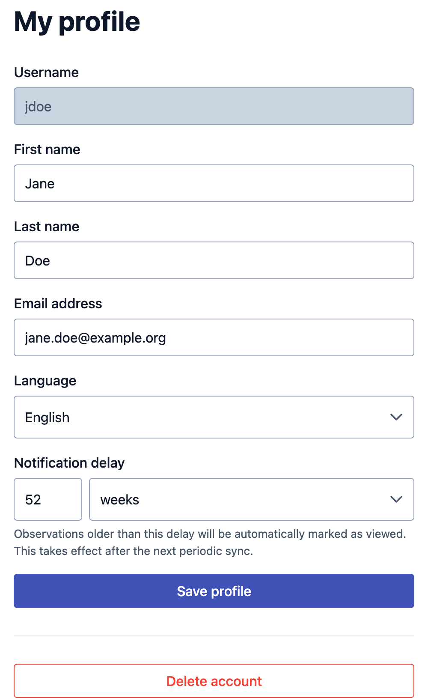
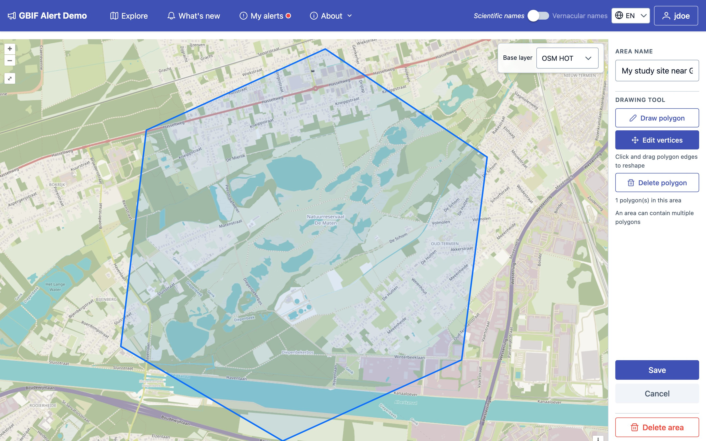
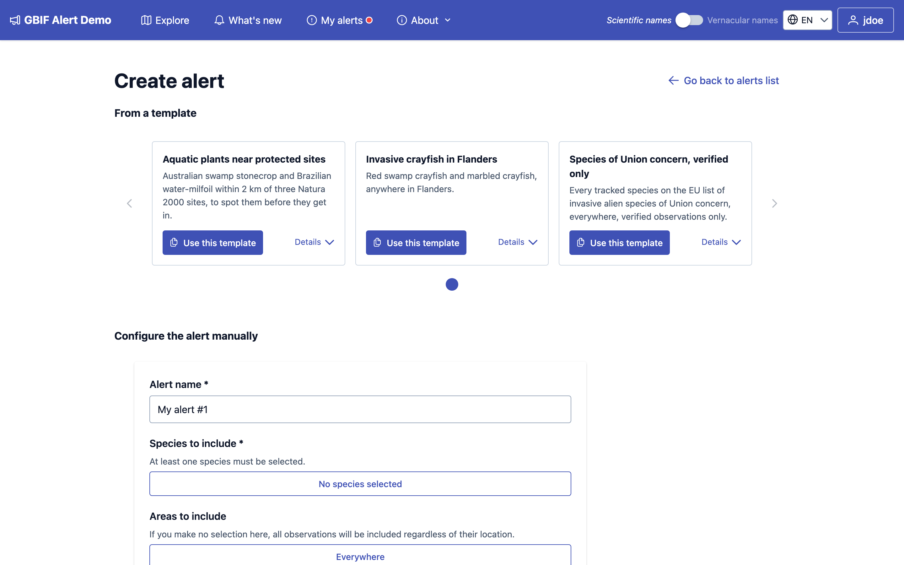
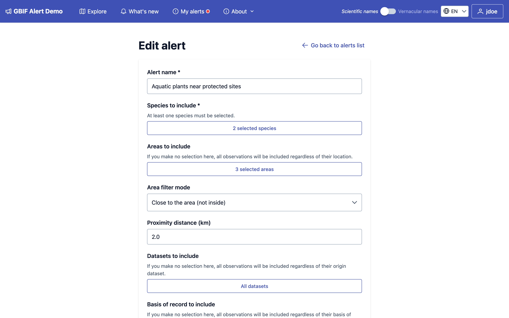
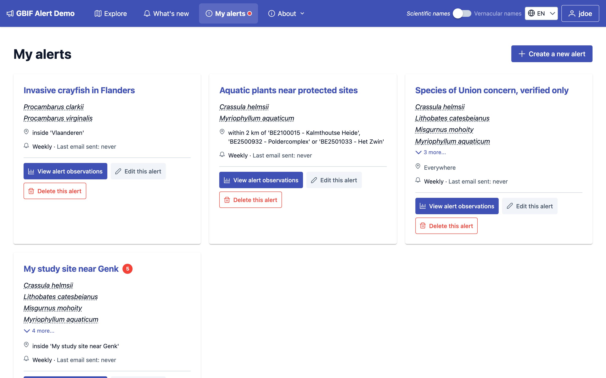
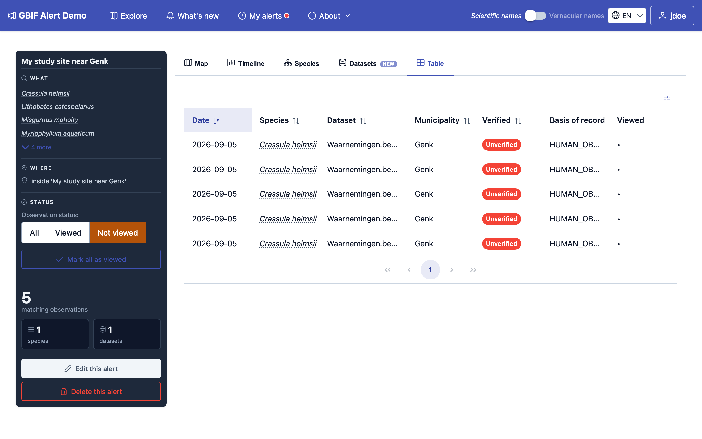
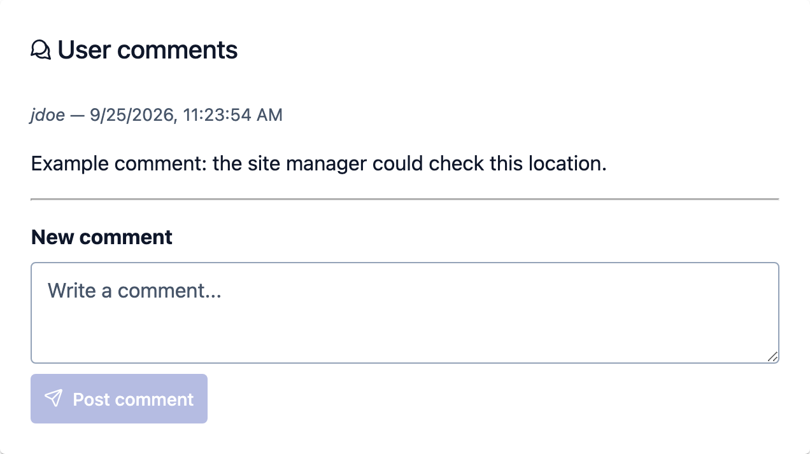

# Getting alerts

With a free account, you can save what you want to follow as **alerts**. The
site then tells you which observations are new for you, on the site and by
email.

## Create an account

Click **Sign up** in the top bar. You need a username, an email address and a
password; your first and last names are optional. Then use **Sign in** whenever
you come back.

Once you are signed in, the top bar gains **My alerts**, and your username
opens your menu: **My profile**, **API tokens** (see
[Use the API](advanced.md#use-the-api)), **Change password**, **My alerts**, **My
user-specific areas** and **Sign out**.

## Your profile

{ width="480" }

**My profile** holds your name, email address and **Language**, which is also
the language of the emails the site sends you.

**Notification delay** decides how far back new observations still count as new
for you. The site often receives old records: an observation made three years
ago may only be published on GBIF today. With the default delay of one year,
such an observation reaches the site without being flagged as new. Shorten the
delay if you only care about recent observations, lengthen it if old records
matter to you too.

**Delete account** removes your account and your alerts.

## Viewed and not viewed

When you are signed in, the site keeps track of which observations you have
already seen, for you only.

- The site downloads new data from GBIF regularly, usually every night. Each new
  observation that matches one of your alerts is marked **Not viewed** for you,
  unless it was observed longer ago than your notification delay.
- Opening an observation marks it **Viewed**. To keep it on your to-do list,
  click **Mark this observation as not viewed** in its details.
- **Mark all as viewed**, on an alert's page, marks every observation of that
  alert as viewed at once.
- A red dot next to **My alerts** in the top bar means at least one of your
  alerts has observations you have not viewed yet.

In the filters, **Observation status** shows **All** observations, only the
**Viewed** ones, or only the **Not viewed** ones. When you are signed in, the
home page opens on your **Not viewed** observations, if you have any: remove
that filter from the active filters to see everything.

!!! note "An alert tells you about what arrives next"

    When you create an alert, the observations already on the site count as
    viewed. From then on, every new matching observation is marked Not viewed.
    To look at what was there before, browse the alert's observations.

## Your own areas

The areas list offers the ones the site's managers have prepared. If your site
is not among them, draw it yourself: areas you create are **user-specific**,
visible to you only, and work everywhere the shared ones do, in the filters and
in alerts.

Open **My user-specific areas** from your menu, click **Add area**, then **Draw
on map**.

- Give the area a name.
- With **Draw polygon** selected, click on the map to place the corners of your
  area, and double-click to finish the shape. An area can contain several
  polygons, for example several ponds of the same reserve.
- **Edit vertices** lets you drag corners and edges to reshape a polygon, and
  **Delete polygon** removes one.
- Click **Save**.

If you already have your area's outline in a GIS, upload it instead: click **Add
area**, then **Upload file**, and pick a GeoPackage (`.gpkg`) file holding a
single layer with one polygon or multipolygon.

In the areas list, your own areas are marked **User-specific**, and the others
**Shared**.

## Create an alert

Open **My alerts** from your menu and click **Create a new alert**.

### From a template

The site's managers may have prepared ready-made alerts, listed under **From a
template**. This is the quickest way to start.

Click **Use this template**, give your alert a name, choose how often you want
emails, and click **Create alert from template**. The new alert is yours: you
can change any of its settings afterwards, and changes to the template later on
do not affect it.

### Configuring it yourself

Or fill in the form under **Configure the alert manually**, further down the
same page.

The settings are the same as the filters on the home page (see
[Filtering](explore.md#filtering)):

- **Alert name**: how you will recognise it in your list and in emails.
- **Species to include**: at least one.
- **Areas to include**: leave empty to follow the species everywhere. When you
  pick areas, choose the **Area filter mode** and **Proximity distance (km)**
  as on the home page.
- **Datasets to include** and **Basis of record to include**: leave empty for
  all of them.
- **Verification filter**: all observations, verified only, or unverified only.
- **Alert notifications frequency**: **Daily**, **Weekly**, **Monthly** or **No
  emails** (see [Emails](#emails)).

Click **Create alert**.

!!! tip "Species are listed one by one"

    An alert follows exactly the species you picked. If the site starts
    tracking a new species later, your alert does not include it until you
    add it. Leaving datasets empty, on the other hand, covers every dataset,
    including ones added later.

## Follow your alerts

**My alerts** lists your alerts with a summary of what each one follows and when
you last received an email about it.

A red number next to an alert's name is how many of its observations you have
not viewed yet.

Click **View alert observations** to open an alert's page: its matching
observations, with the same Map, Timeline, Species, Datasets and Table tabs as
the home page, and a panel summarising the alert. The page opens on the
observations you have not viewed yet; choose **All** under **Observation
status** to see every matching observation. From there you can also **Mark all
as viewed**, **Edit this alert** or **Delete this alert**.

## Emails

When an alert has observations you have not viewed, the site emails you about
them, at most once per period of the frequency you chose: at most one email a
day for **Daily**, a week for **Weekly**, and so on. The first one is sent
shortly after new observations arrive. With **No emails**, you still see your
Not viewed observations on the site.

The email says how many new observations the alert has, with a sample of them:
GBIF ID, coordinates, date, species and dataset. Each GBIF ID links to the
observation on the site.

## Comments

Signed-in users can comment on any observation, for example to share what they
found on the ground, or to flag a doubtful identification. Comments appear at
the bottom of the observation's details, under **User comments**, for every
visitor to read.

{ width="480" }
