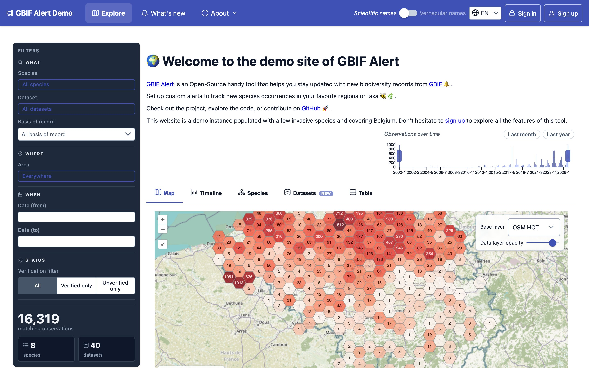
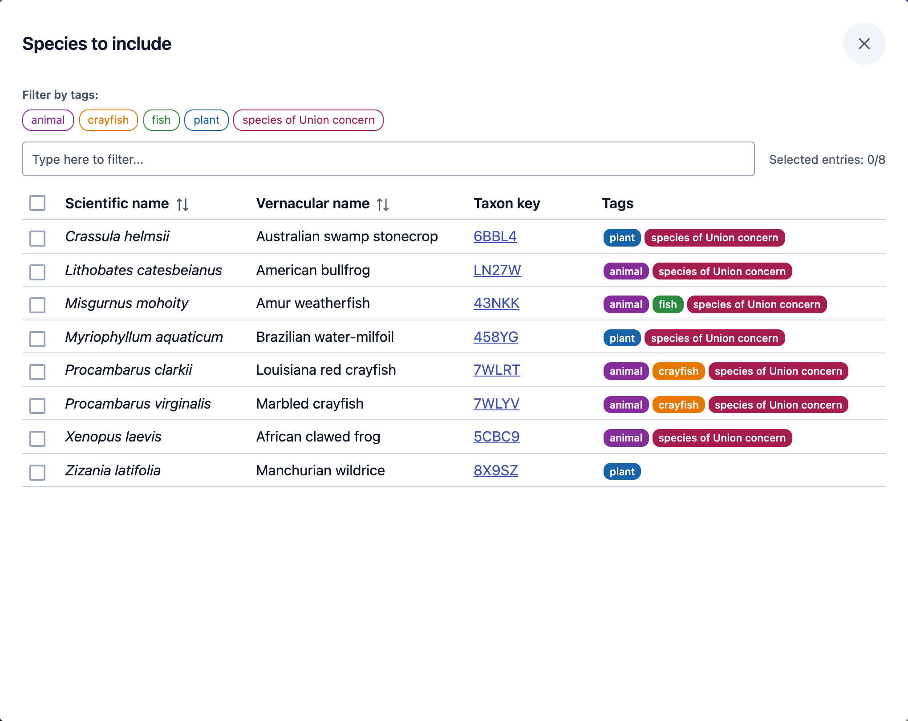
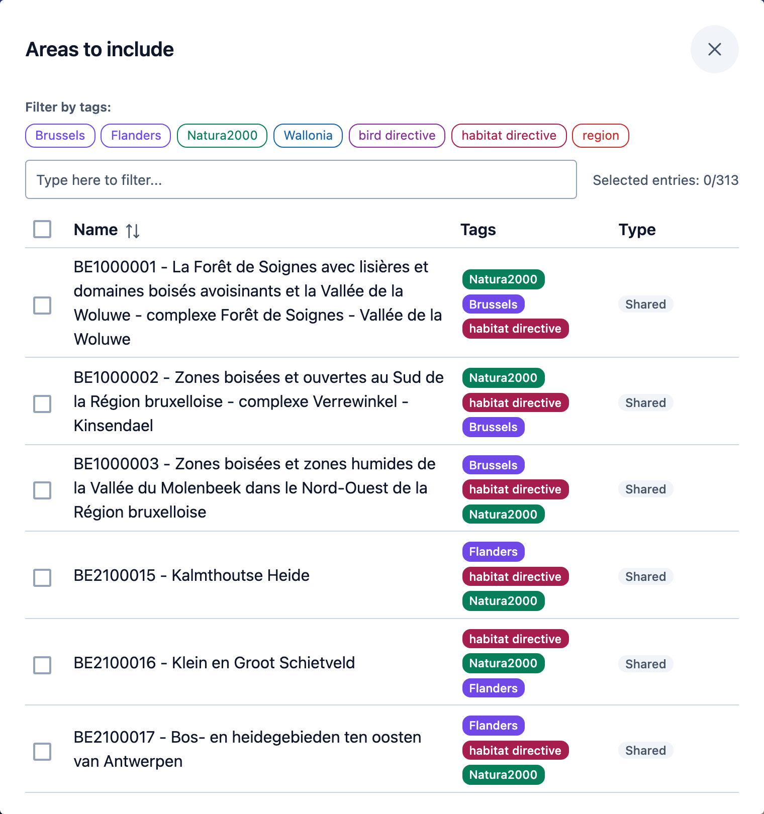
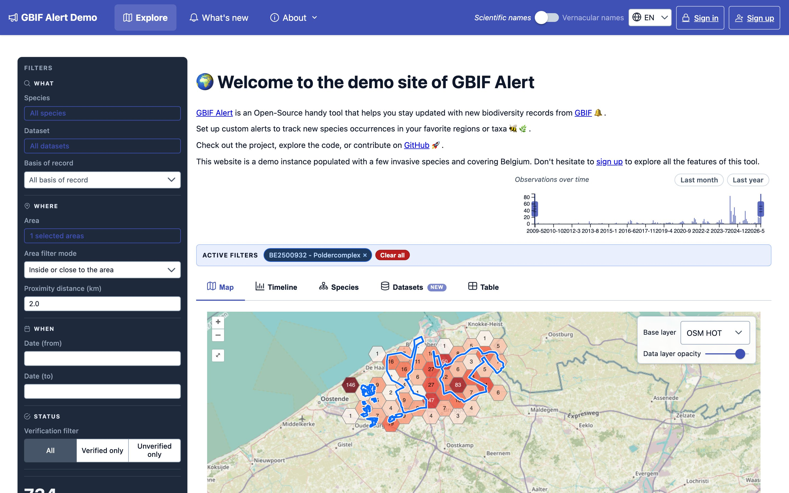
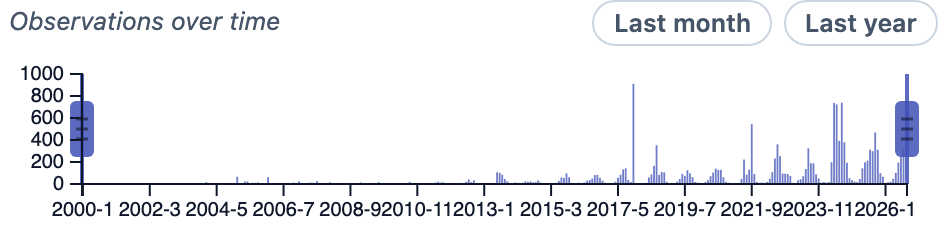
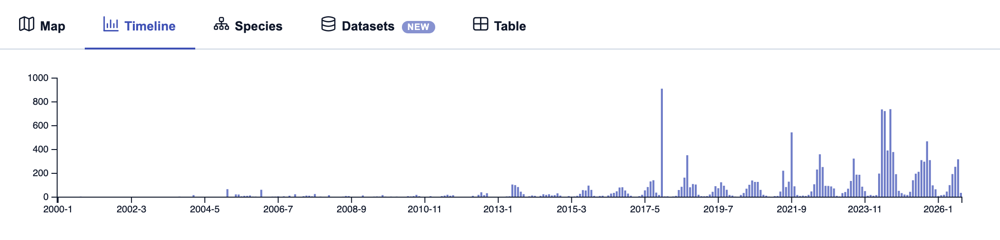
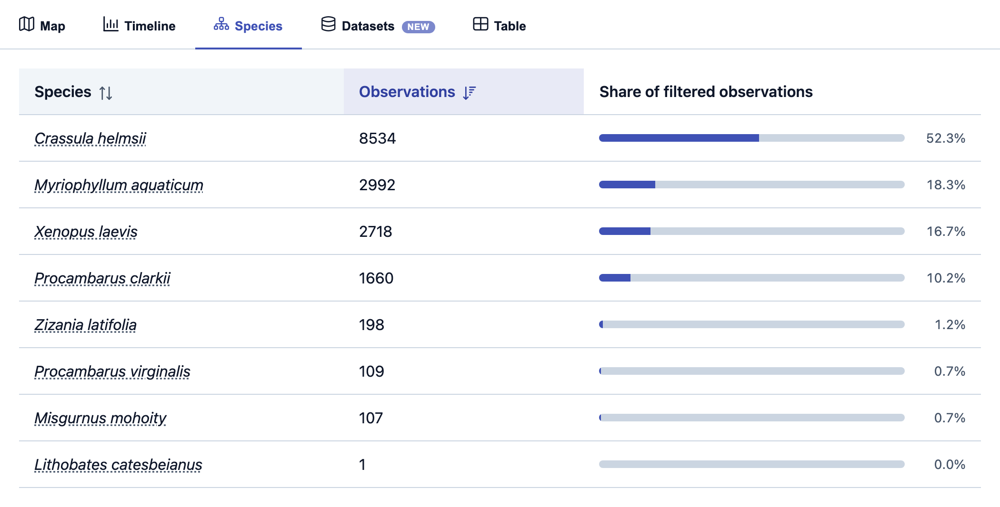
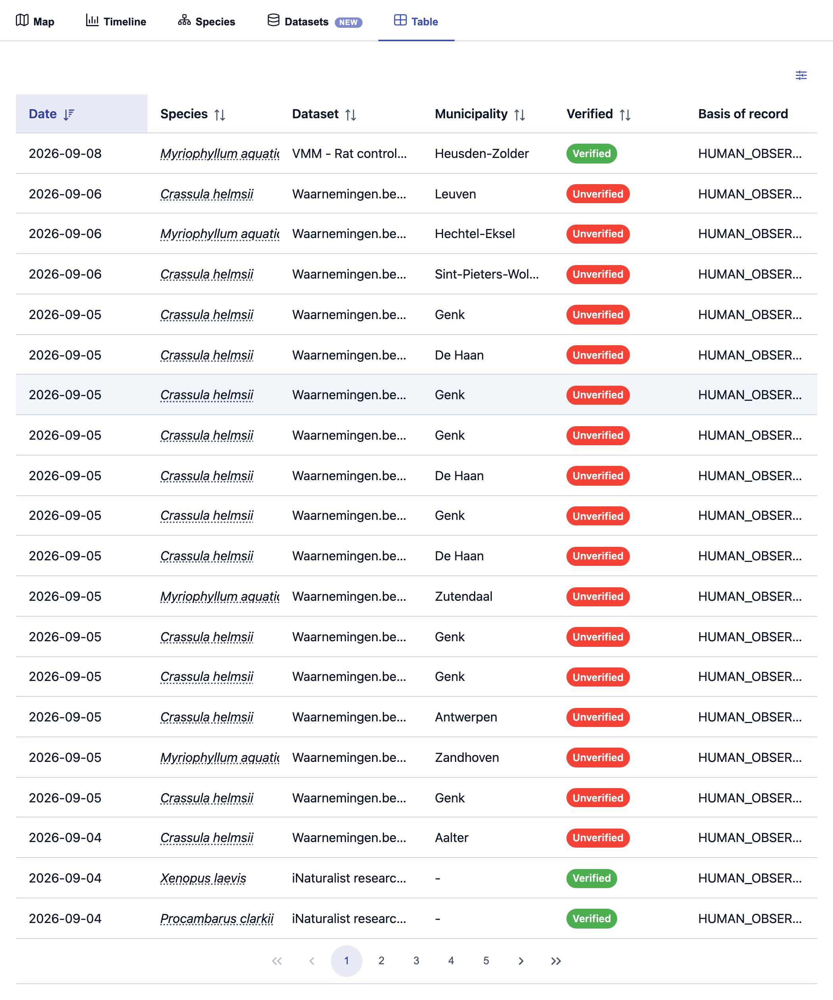
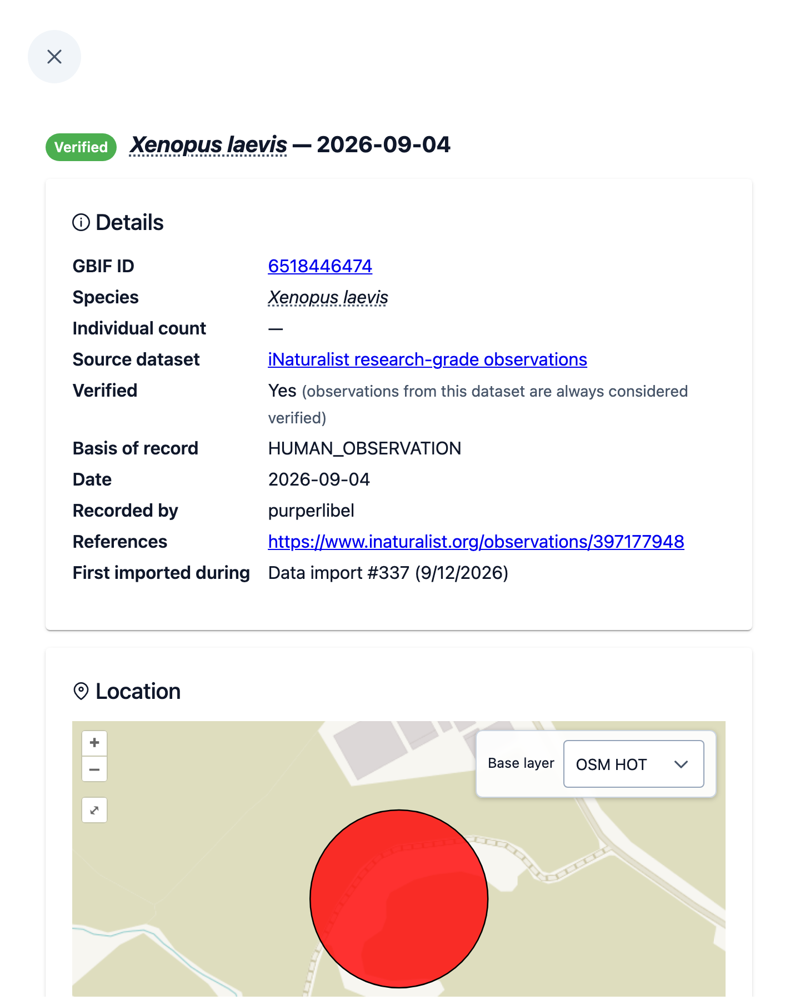

# Exploring the data

You do not need an account to explore a GBIF Alert site: everything on this page
works without signing in. An account adds alerts, which the next part of this
guide covers.

!!! note "About the screenshots"

    The screenshots come from the [demo site](https://demo.gbif-alert.org),
    which follows a few invasive species in Belgium. Each GBIF Alert site
    tracks its own species and areas, and may look a little different.

## The home page

The home page has three parts:

- **Filters**, on the left, choose which observations you see. On a phone they
  are behind the **Filters** button.
- **Observations over time**, at the top, is a small chart of the matching
  observations per month. You can also use it to pick a period (see
  [When](#when)).
- **The results**, in tabs: **Map**, **Timeline**, **Species**, **Datasets**
  and **Table**.

At the bottom of the filters, a counter shows how many observations match, and
how many species and datasets they come from. Click the species or datasets
count to jump to that tab.

In the top bar:

- **Scientific names / Vernacular names** switches how species are named
  everywhere on the site.
- **EN** changes the language.
- **About** explains what the site is for (**About this site**) and where its
  data comes from (**About the data**). **What's new** has the site's news.

## Filtering

Filters apply as soon as you change them. They combine: an observation is shown
only if it matches every filter you set. Within a single filter, choosing
several values widens it: selecting two species shows observations of either.

Active filters are listed above the results. Click the **x** on one to remove
it, or **Clear all** to start over.

!!! tip "Share what you see"

    The address in your browser's address bar holds your filters. Bookmark it
    to come back to the same view, or send it to a colleague to show them
    exactly what you are looking at.

### What

**Species** opens the list of species this site tracks. Type in the box to find
one, or click a tag to show only the species that carry it. Tick the species
you want to see.

**Dataset** works the same way. A dataset is a collection of records published
to GBIF by one organisation or project, such as a regional recording scheme or a
citizen-science platform.

**Basis of record** is how the record was made. The most common ones are
`HUMAN_OBSERVATION` (someone saw the organism), `MACHINE_OBSERVATION` (a camera
trap or another sensor) and `PRESERVED_SPECIMEN` (a specimen kept in a
collection).

### Where

**Area** opens the list of areas the site's managers have made available, for
example protected sites or administrative regions. It works like the species
list: search, filter by tag, and tick one or more areas.

Selected areas are drawn as blue outlines on the map. Once you have chosen at
least one, two more settings appear:

- **Area filter mode**
    - **Inside the area**: only observations inside the areas.
    - **Close to the area (not inside)**: only observations around the areas,
      within the proximity distance, and not inside them. Use it to spot a
      species that is getting close to a site before it arrives.
    - **Inside or close to the area**: both of the above.
- **Proximity distance (km)**: how far around the areas to look, from 0.1 to
  50 km. It starts at 5 km.

!!! note

    Some sites start with an area already selected, so the home page opens on
    their region of interest. Remove it from the active filters to see
    everything.

### When

Type dates in **Date (from)** and **Date (to)**, or use the **Observations over
time** chart: drag its left and right handles to the months you want. Dragging
a handle all the way to the edge removes that limit. **Last month** and **Last
year** are shortcuts for the most common periods.

These are the dates the organisms were observed, which can be long before the
records reached this site.

### Status

The **Verification filter** shows **All** observations, **Verified only**, or
**Unverified only**.

An observation is verified when its publisher has marked the record on GBIF as
validated, usually by an expert. Records without such a mark count as
unverified. The site's managers can also decide that every record from a given
dataset is always, or never, verified: the observation details say so when that
applies.

Unverified does not mean wrong. Many unverified records are correct, but nobody
has checked them yet, and the first records of a species arriving somewhere are
often in that state.

## The results

### Map

The map groups observations into hexagons, with the number of observations in
each: the darker the hexagon, the more observations. Zoom in far enough and the
hexagons give way to individual observations. Click one to see what was
recorded there, and click its name to open it.

At the top right, **Base layer** changes the background map, and **Data layer
opacity** makes the observations more or less transparent so the background
shows through.

### Timeline

The number of matching observations per month.

### Species and Datasets

How the matching observations split between species, or between datasets, with
each one's share of the total. Click a column heading to sort.

### Table

One row per observation, newest first. Click a column heading to sort by it,
and use the sliders icon above the table's right-hand side to choose which
columns to show.

## Looking at one observation

Click a row in the table, or an observation's name on the map, to open its
details.

{ width="480" }

- **GBIF ID** links to the record on GBIF, and **References**, when present, to
  the original record on the platform that published it.
- **Verified** says whether the observation is verified and why (see
  [Status](#status)).
- **First imported during** is when the observation first reached this site.
  The site downloads new data from GBIF regularly, and each download is a data
  import.

The map under **Location** shows where the observation was made. The circle is
how precise that location is:

- a **teal** circle is the precision given in the record: the organism was
  somewhere inside it;
- a **red** circle means the record does not say how precise it is, and is
  drawn with a 100 m radius by convention.
